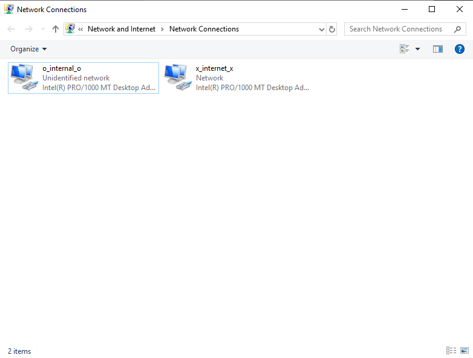
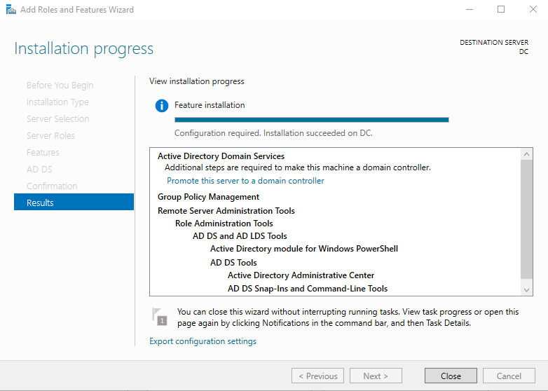
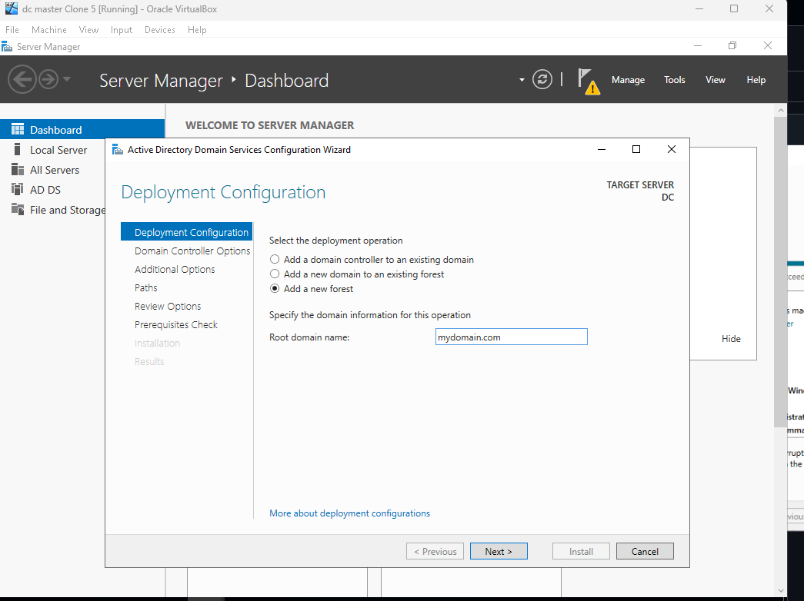
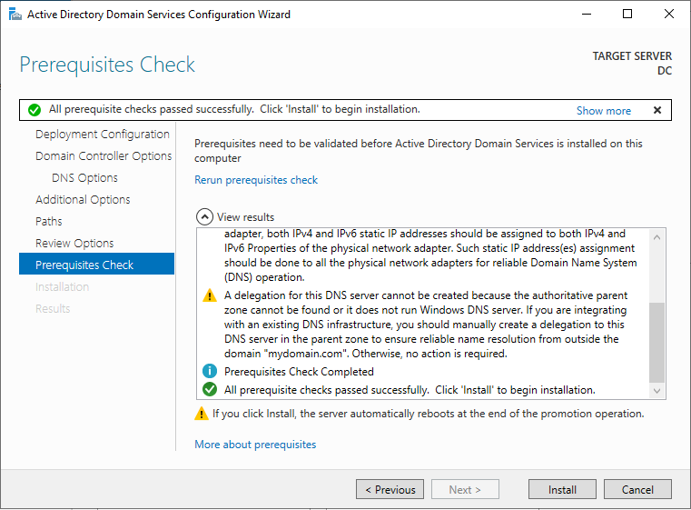
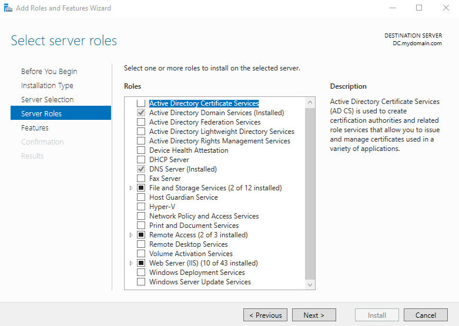
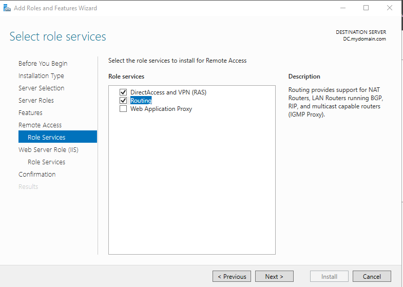
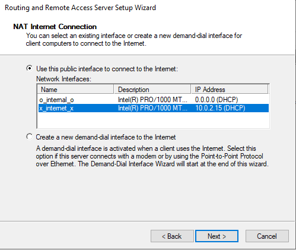

<h1>Active Directory using Powershell</h1>

 

<h2>Description</h2>
This project consists of building a Domain Controller (AD DS + DNS.) Joining a Windows client to the domain, and bulk-creating 1000 users with PowerShell.
<br />


<h2>Languages and Utilities Used</h2>

- <b>PowerShell</b> 
- <b>Active Directory Domain Services (AD DS)</b>
- <b>Active Directory Users and Computers (ADUC)</b>

<h2>Environments Used </h2>

- <b>Windows 2019 Server(DC)</b>
- <b>Windows 10</b>
- <b>Oracle VirtualBox</b>

<h2>Network Plan </h2>

- <b>VirtualBox: 2 NICs on the server</b>

     - <b>NIC 1 (Internal Network): AD lab traffic (domain + client communication)</b>
     
     - <b>IP: 192.168.0.10<b>
     - <b>Mask: 255.255.255.0<b>
     - <b>Gateway: empty<b>
     - <b>DNS: 127.0.0.1 (loopback)<b>
     - <b>NIC 2 (NAT): Internet access (updates)</b>>
- <b>DC has RRAS/NAT configured</b>
  - <b>Client gateway: 192.168.0.10</b>
  - <b>DNS: 192.168.0.10</b>


<h2>Lab walk-through:</h2>

<p align="center">
We need to diferenciate the 2 networks adapters on the controller. One adapter is for the internal and the other is for the outside internet.<br/> I'll rename them like this to stand out more when we go to configure them later.
 <br/> 
 <br/> Tip: The adapter with the autoconfig ipv4 is typically the internal adapter.


<br />
<br />
Assign IP address to the internal network  <br/>We will right click -> properties into the internal adapter. <br/> <br/> According to our network plan this is what our configuration would look like:<br/>

<br />
<br />
Installation of AD DS and creating domain. <br/> 
Go through the "Add Roles and Features Wizard" on Server Manager to install AD DS.
<br/>

<br />
<br />
Promote the server to a doamin controller and add a new forest. For this lab we'll just use "mydomain.com"  <br/>

<br />
<br />
Once you pass prequisite check, installation should be good to go. VM will auto-restart afer installation. <br/>

<br />
<br />
Next on our network plan is to installl RAS/NAT to allow client to access internal network through the DC<br/>On the server manager -> Add Roles and Features -> Enable Remote Access<br/>

<br />
<br />
Lets make sure we have routing enabled in the features tab, then we will install:  <br/>

<br />
<br />
Installation complete:  <br/>

<br />
<br />
Observe the wiped disk:  <br/>

nstallation complete:  <br/>

<br />
<br />
nstallation complete:  <br/>

<br />
<br />
</p>

<!--
 ```diff
- text in red
+ text in green
! text in orange
# text in gray
@@ text in purple (and bold)@@
```
--!>
